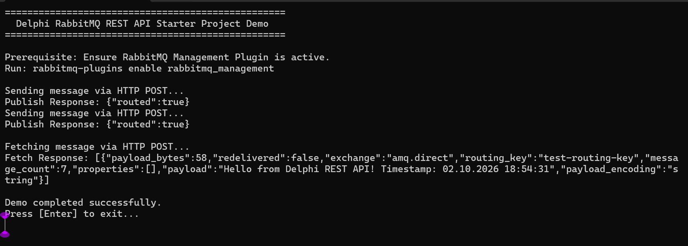

# Delphi & Free Pascal RabbitMQ REST API Starter Kit

A lightweight, working example demonstrating how to send and fetch messages from **RabbitMQ** using standard HTTP REST endpoints in **Delphi** and **Free Pascal / Lazarus**.

## 🚀 Quick Start
This project contains a minimal codebase showing how to use native HTTP clients (such as `TNetHTTPClient` or `IdHTTP`) to communicate with the RabbitMQ Management Plugin API.

### Features Included:
* **Send Message:** Publishes a payload to a specific exchange using `POST /api/exchanges/vhost/name/publish`.
* **Fetch Message:** Retrieves a payload from a queue using `POST /api/queues/vhost/name/get` (Request/Response pattern).


## 🛠️ Prerequisites & Environment Setup

To run this demo successfully, your development environment and RabbitMQ broker must be properly configured. 

### 1. RabbitMQ Broker Configuration
This starter kit relies on RabbitMQ's Management Plugin, which is **not enabled by default**. 
Open your server terminal or command prompt and run the following command to enable it:

```bash
rabbitmq-plugins enable rabbitmq_management
```
*   **Default Port:** This activates the HTTP REST API on port `15672`.
*   **Queue Setup:** Before running the application, log into your RabbitMQ Management Dashboard (`http://localhost:15672`), create a queue named `test-queue`, and bind it to the `amq.direct` exchange using the routing key `test-routing-key`.

### 2. Delphi IDE Configuration
1. Open Delphi and load the `RabbitMQRestDemo.dpr` project.
2. Select your target platform (**Win32** or **Win64**) in the Project Manager.
3. Build the project (`Ctrl + F9`).
4. Run the application!

   

## 🔍 Troubleshooting & Common Errors

If the starter kit fails to run or connect, check these common error messages and their solutions:

### ❌ `HTTP Protocol Error: 401 Unauthorized`
*   **Cause:** Your username or password credentials are incorrect.
*   **Fix:** Check `RABBITMQ_USER` and `RABBITMQ_PASS` in the `.dpr` code. If you are accessing RabbitMQ remotely, note that the default `guest`/`guest` credentials **only work from localhost** by default. You will need to create an administrative user in the RabbitMQ dashboard for remote access.

### ❌ `HTTP Protocol Error: 404 Not Found`
*   **Cause 1:** The RabbitMQ Management Plugin is not enabled.
*   **Fix 1:** Run `rabbitmq-plugins enable rabbitmq_management` and restart the broker.
*   **Cause 2:** The specific Exchange or Virtual Host does not exist.
*   **Fix 2:** Verify that the default Virtual Host `/` is properly URL-encoded as `%2F` in your request path. If your queue or exchange has custom naming, double-check spelling and case sensitivity.

### ❌ `Socket Error # 10061: Connection Refused`
*   **Cause:** The application cannot find a running broker at the specified IP address or port.
*   **Fix:** Ensure RabbitMQ is running locally (check your Windows Services or Docker containers). Verify you are targeting port `15672` (the Management port) and **not** `5672` (the native AMQP protocol port).

### ❗ Delphi 2009 + Indy: `Range check error` when using the default vhost

If you are using **Delphi 2009 with Indy 10.6.3.14**, a request such as:

```text
http://localhost:15672/api/exchanges/%2F/amq.direct/publish
```

may raise a Delphi `ERangeError` before the HTTP request is sent.

The call stack typically ends in:

```text
IdGlobal.CharIsInSet
IdURI.TIdURI.NormalizePath
IdURI.TIdURI.SetURI
IdURI.TIdURI.Create
IdHTTP.TIdCustomHTTP.PrepareRequest
```

This is caused by an incompatibility involving Delphi 2009, range checking, and the `inline` implementation of Indy's `CharPosInSet()` helper. The `%2F` in the URL is valid and is required to represent RabbitMQ's default `/` virtual host.

A workaround is to remove the `inline` directive from `CharPosInSet()` in `IdGlobal.pas`:

```delphi
function CharPosInSet(const AString: string;
  const ACharPos: Integer; const ASet: String): Integer;
```

instead of:

```delphi
function CharPosInSet(const AString: string;
  const ACharPos: Integer; const ASet: String): Integer;
{$IFDEF USE_INLINE}inline;{$ENDIF}
```

Rebuild Indy and the application after making this change.

## Using the demo with Lazarus

The demo can also be compiled with **Lazarus / Free Pascal (FPC)**.

### Requirements

* Lazarus with a recent Free Pascal compiler
* RabbitMQ with the Management plugin enabled
* RabbitMQ Management API available at `http://localhost:15672/`
* A RabbitMQ user with permission to access the Management API

### Opening the project

Open the Lazarus project file:

```text
RabbitMQRestDemo.lpi
```

in Lazarus.

If Lazarus asks to locate the project source files or Indy units, add the required Indy source directories to the project's search path.

### Indy

The demo uses Indy for HTTP communication. Make sure a Lazarus-compatible version of **Indy 10** is available in the FPC/Lazarus environment.

Depending on how Indy was installed, you may need to add the Indy source directories to:

**Project → Project Options → Compiler Options → Paths → Other unit files**

Typically the relevant Indy directories include:

```text
Indy10/Lib
Indy10/Lib/Core
Indy10/Lib/System
Indy10/Lib/Protocols
```

The exact paths depend on where Indy is installed.

### Running the demo

Start RabbitMQ and make sure the Management API is enabled. Then run the demo from Lazarus.

The default Management API URL is:

```text
http://localhost:15672/
```

The demo uses the RabbitMQ Management REST API to perform operations such as declaring exchanges/queues and publishing messages.

For the default RabbitMQ virtual host `/`, the `/` character must be URL-encoded as `%2F`. For example:

```text
http://localhost:15672/api/exchanges/%2F/amq.direct/publish
```

Do not replace `%2F` with `/`, as that changes the meaning of the RabbitMQ API URL.

### Troubleshooting

If Lazarus reports missing Indy units, check the project's unit search path and make sure the required Indy directories are included.

If the demo compiles but fails to connect, first verify that RabbitMQ's Management API is reachable in a browser:

```text
http://localhost:15672/
```

The default RabbitMQ Management API port is `15672`.

For authentication, the demo uses RabbitMQ's HTTP API credentials rather than the AMQP connection settings.

---

## 💡 Get Help Beyond the Basics
Struggling with advanced enterprise architectures, message persistence, or network dropouts? 

Bypass the trial-and-error of raw HTTP setups. Upgrade to **Habari STOMP Client** for native, robust connectivity out of the box.

👉 **[Get Free Basic Support and Your 3-Month Trial Here](https://habarisoft.com)**


---

## ⚠️ Is the REST API Right for Your Production App?

While the HTTP REST API is excellent for quick integration testing, DevOps scripting, or low-frequency monitoring, it introduces severe architectural bottlenecks when used as a primary messaging layer in commercial Delphi applications:

### 1. The Speed Bottleneck (HTTP Overhead)
Every single message sent or received via REST requires a brand new HTTP connection lifecycle: **TCP Handshake ➡️ TLS Negotiation ➡️ HTTP Header Parsing ➡️ Connection Tear-down.** This introduces massive latency. For high-throughput applications, this approach is **10x to 50x slower** than a native messaging protocol.

### 2. Request/Response vs. Real-Time Streaming
The REST API forces a strict **Request/Response** architecture. To receive new messages, your Delphi application must constantly "poll" (query) the RabbitMQ server at set intervals (e.g., every 500ms).
* **Too fast:** You waste massive CPU, thread overhead, and network bandwidth on empty responses.
* **Too slow:** Your application suffers from lag and cannot react to data in real time.

### 3. No Native Message Broker Features
By relying on HTTP, your Object Pascal applications lose access to enterprise messaging features like:
* Native asynchronous message streaming (Server-to-Client push notifications)
* Client-side acknowledgments (`ACK`/`NACK`) to guarantee zero data loss
* Complex transaction management (`COMMIT`/`ABORT`)

---

## ⚡ The Solution: High-Performance Native STOMP Streaming

To achieve true, event-driven streaming with lightning-fast throughput, your applications should bypass HTTP and communicate over a native wire protocol like **STOMP (Simple Text Orientated Messaging Protocol)**.

### Upgrade to Habari STOMP Client Components

The **Habari STOMP Client** libraries bridge this gap perfectly for the Delphi and Free Pascal ecosystems. Instead of restrictive HTTP polling, Habari establishes a single, persistent, secure TCP socket stream to RabbitMQ.

| Feature | This REST API Starter Kit | Habari STOMP Client |
| :--- | :--- | :--- |
| **Architecture** | Synchronous Request/Response | **True Asynchronous Streaming** |
| **Data Delivery** | Periodic Manual Polling | **Instant Server-Side Push** |
| **Performance** | High Latency / High Overhead | **Ultra-Low Latency / High Throughput** |
| **Reliability** | Manual error handling | **Heartbeating / Automatic Failover on connect** |
| **Licensing** | Free / Open Source | **Commercial Enterprise Support** |

### Get Production Ready Today
Don't waste engineering hours writing custom boilerplate code to handle connection drops or polling loops. 

👉 **[Download the 3-Month Complete Trial (€30.00) at Habarisoft.com](https://habarisoft.com)**  
*Full source code, multi-broker support (RabbitMQ, ActiveMQ, Artemis), and production-tested demos included.*

---

## License
This starter kit is licensed under the MIT License. Feel free to use it for basic testing and prototyping.
